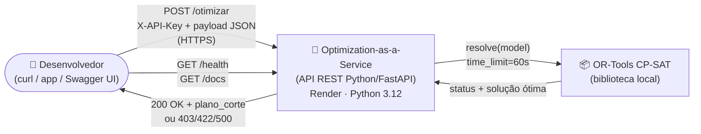
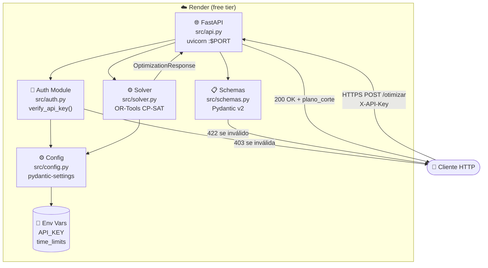
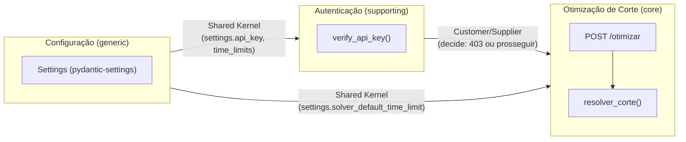
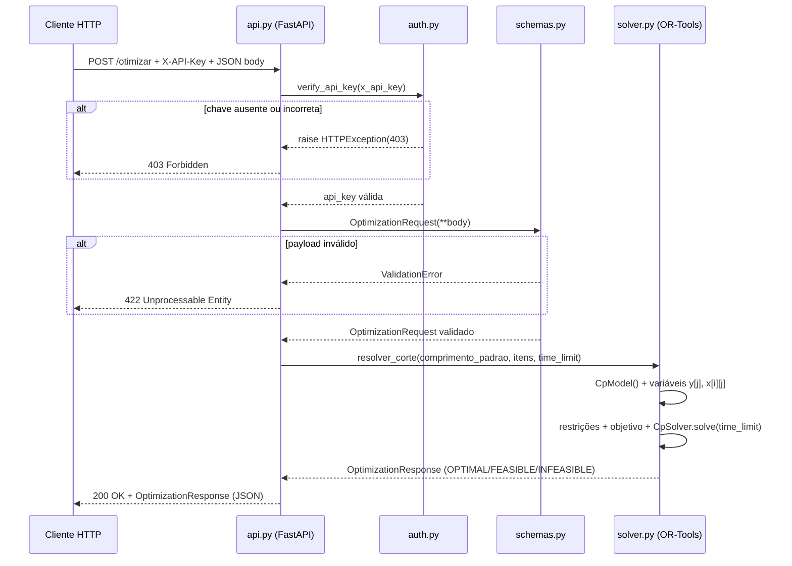
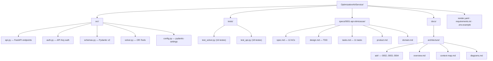

# Diagramas de arquitetura — Optimization-as-a-Service

> Alto nível (C4 L1–L2 + mapa de bounded contexts + fluxo de requisição).
> Renderiza no GitHub e no Antigravity/Claude. Rótulos na linguagem ubíqua do `glossary.md`.

## 1. Contexto do sistema (C4 L1)

## 2. Containers (C4 L2)

## 3. Mapa de bounded contexts (DDD)

## 4. Fluxo de uma requisição de otimização (Sequence)

## 5. Estrutura de arquivos (referência rápida)

